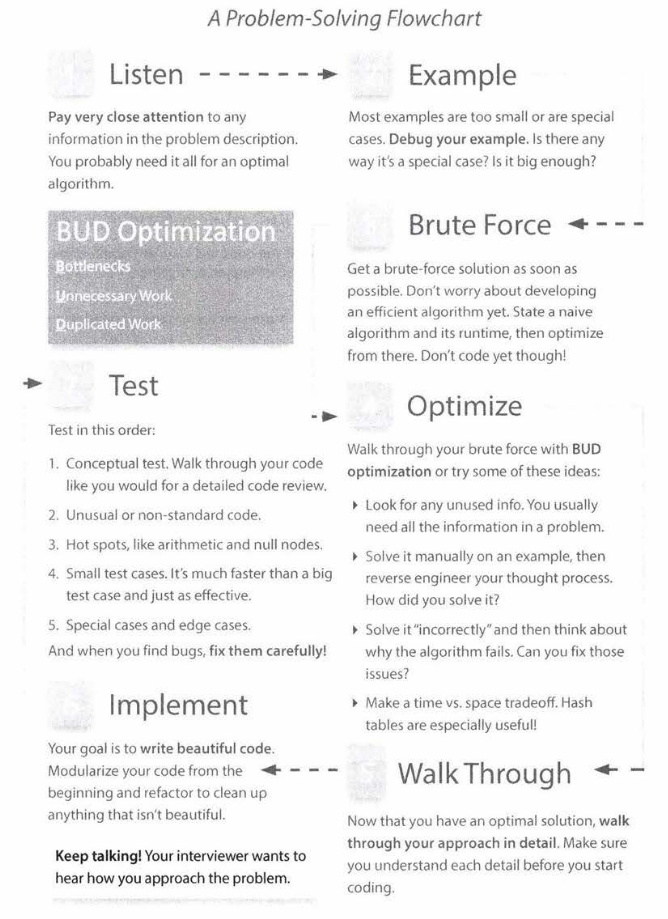

# A Problem-Solving Flowchart

При решении задачи на интервью следует придерживаться следующего процесса. Единственное, что данный процесс требует небольших модификацией,
в соответствии с моим опытом прохождения алгоритмических собеседований:

1. На этапе Listen **вы должны спросить про ограничения на вход вашего алгоритма**. Пример: Требуется реализовать алгоритм конкатенации
   строк. И если не спросить про требования к входным данным, сразу на ум приходит наивная реализация про выделение достаточной памяти под
   конкатенацию двух строи и копирование их в эту памяти. А что делать, если у нас одна строка 20Gb и на вычислительном устройстве всего
   лишь 32Gb RAM памяти? Тогда алгоритм будет совсем другой и сложнее, решение будет уже лежать в области "Алгоритмы во внешней памяти". Так
   же, иногда ограничения на входные данных могут дать подсказку на поиск более оптимального решения.
2. **Этап Brute Force не нужен**, и даже вреден. На самом деле, интервьюер, ожидает от кандидата ответа с наилучшей асимптотической
   сложностью и как можно скорее. То, что кандидат смог найти решение задачи за O(N^3), а задача решается за O(N) - это никого не обрадует,
   а только навредит.

Изображение было позаимствовано из
книги [Cracking the Coding Interview: 189 Programming Questions and Solutions](https://www.amazon.com/Cracking-Coding-Interview-Programming-Questions/dp/0984782850)